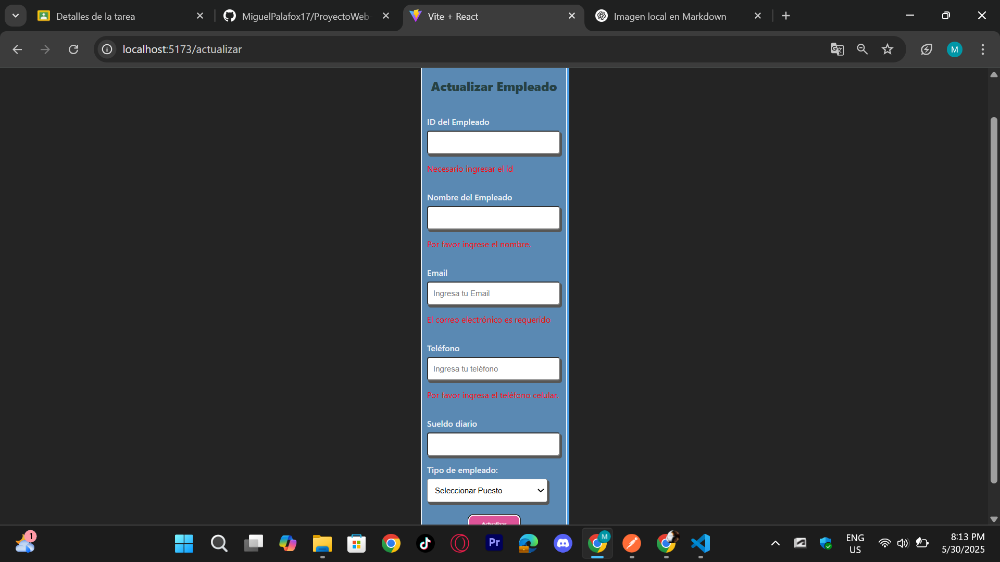
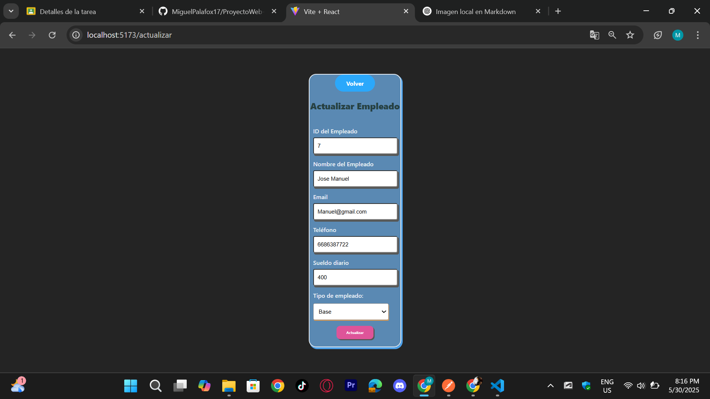

# Componente `Actualizar`

Este componente permite la **actualización de información de un empleado existente** en la BD.

---

## Estructura General

### Imports
```js
import './Actualizar.css';
import { useState, useEffect } from "react";
import BackButton from '../../Components/Back-Button/Back-Button';
```
- `useState` y `useEffect`: Componente de React para manejar el estado y los efectos.
- `BackButton`: Componente reutilizable para regresar a la vista anterior.

---

## Estados del Componente

Se manejan múltiples estados para controlar el formulario:

- Identificación del empleado: `id`, `errorId`
- Datos personales: `nombre`, `errorNombre`, `email`, `emailError`, `telefono`, `errorTelefono`
- Detalles del empleado: `tipoEmpleado`, `sueldoDiario`
- Estados de errores y exito: `serverError`, `serverTelefonoError`, `serverEmailError`, `successMessage`

---

## Validaciones

Funciones que se encargadasn de validar los campos antes de enviar los datos del formulario:

- `handleIdSubmit()`: Verifica si el ID no está vacío y es numérico.
- `handleNameSubmit()`: Valida que el nombre no esté vacío.
- `validateEmail(input)`: Valida el formato del correo electrónico.
- `validationTelefono()`: Verifica que el teléfono no esté vacío.



---

## useEffect

Se ejecuta cuando cambia el ID del empleado para cargar de manera automatica los datos del empleado desde la API:

```js
fetch(`http://localhost:3000/obtenerDatos_Empleado/${id}`)
```

---

## handleSubmit

Funcion principal que maneja el envío de los datos del formulario para actualizar al empleado:

1. Ejecuta las validaciones.
2. Si las validaciones fallan, muestra errores.
3. Si son válidas, envía un `PUT` a la ruta:

```js
`http://localhost:3000/actualizar_Empleado`
```

4. Maneja errores del servidor como:
   - Email o teléfono duplicado.
   - Errores de conexión o de respuesta.

---

## Renderizado

Muestra un formulario con campos para:
- ID (para buscar)
- Nombre
- Email
- Teléfono
- Sueldo Diario
- Tipo de Empleado (select)

También incluye un botón `Actualizar` y muestra mensajes de éxito o error.

