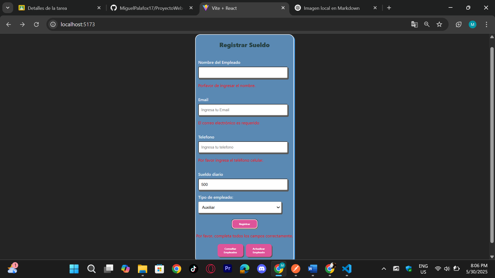
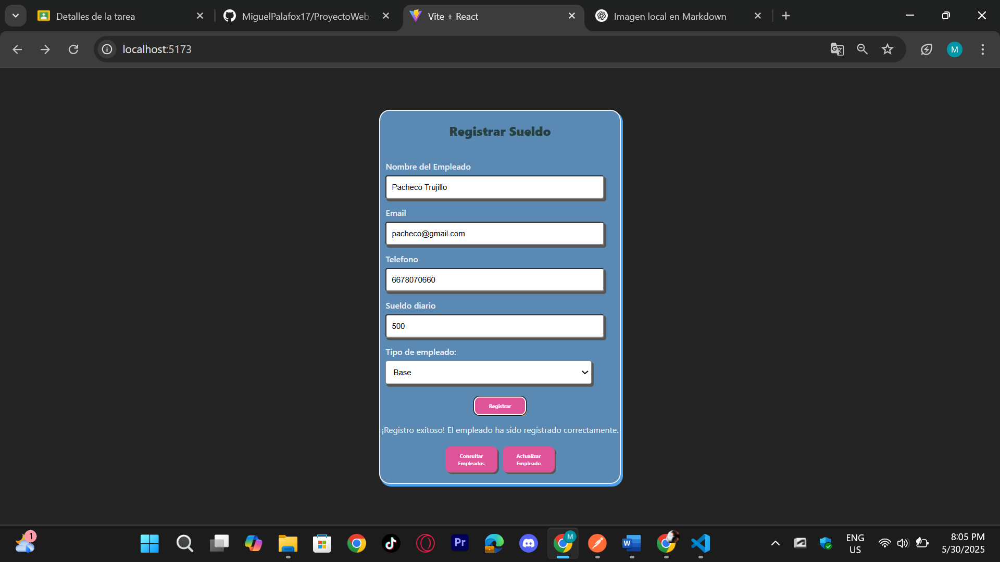

# `Registrar.jsx`

Este componente representa el **formulario de registro de empleados** en una aplicación React. Incluye múltiples campos con validaciones, manejo de errores y conexión a un backend para almacenar los datos del empleado.

---

## Importaciones

```javascript
import { useNavigate } from "react-router-dom";
import './Registrar.css';
import { useState } from "react";
```

- `useNavigate`: Componente de `react-router-dom` para redireccionar entre páginas.
- `./Registrar.css`: Archivo CSS para el estilo del formulario.
- `useState`: Componenete de React para manejar el estado.

---

## Estados Utilizados

En el componente se definen múltiples estados para poder manejar todos los campos del formulario:

- `nombre`, `tipoEmpleado`, `sueldoDiario`, `email`, `telefono`: campos del formulario.
- `errorNombre`, `emailError`, `errorTelefono`: mensajes de validación de los campos.
- `serverError`, `serverTelefonoError`, `serverEmailError`, `successMessage`: manejo de errores y éxito del servidor.

---

## Validaciones

- **Nombre**: No puede estar vacío.
- **Email**: Debe tener formato válido.
- **Teléfono**: Debe tener exactamente 10 dígitos.
- **Tipo de empleado**: Debe seleccionarse una opción válida.

Estas validaciones se aplican antes de enviar los datos al servidor. Si ocurren errores, estos muestran mensajes debajo de cada campo.



---

## Envío del Formulario

```javascript
const handleSubmit = async (e) => {
  e.preventDefault();
  ... //Resto del del codigo
}
```

- Ejecuta todas las validaciones.
- Si todo es válido, construye un JSON en  `userData` y lo envía a la API:  
  `POST http://localhost:3000/registrar_Empleado`
- Maneja los mensajes de exitoso o errores desde el servidor.



---

## Navegación

El formulario incluye botones para redirigir a otras páginas:

- `/consultar`: Consultar empleados registrados.
- `/actualizar`: Actualizar datos de un empleado.

```javascript
<button onClick={() => navigate('/Consultar')}>Consultar Empleados</button>
```
```javascript
<button onClick={() => navigate('/actualizar')}>Actualizar Empleado</button>
```

---

## Formulario Renderizado

El formulario muestra campos para:

- Nombre
- Email
- Teléfono
- Sueldo Diario
- Tipo de Empleado (con menú desplegable)

Además, muestra mensajes de error/success debajo de cada campo y al final del formulario.

