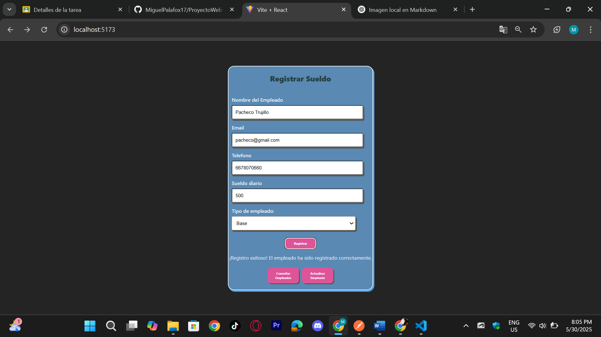

# Componente `App.jsx`

Este componente es el **componente principal** de la aplicación en React. La cual se encarga de definir las rutas principales de la aplicación utilizando la librería `react-router-dom`.

---

## Importaciones

```javascript
import './App.css';
import { Route, Routes } from 'react-router-dom';
import Consultar from './Pages/Consultar/Consultar';
import Registrar from './Pages/Registrar/Registrar';
import Actualizar from './Pages/Actualizar/Actualizar';
```

- `App.css`: Archivo de estilo global para este componente.
- `Routes` y `Route`: Componentes provenientes de `react-router-dom` para definir la navegación de las rutas.
- `Consultar`, `Registrar`, `Actualizar`: Componentes de la página, ubicadas en la carpeta `Pages`, que se renderizan según la ruta actual.

---

## Estructura del Componente

```javascript
function App() {
  return (
    <>
      <div className="App">
          <Routes>
            <Route path="/" element={<Registrar />} />
            <Route path="/consultar" element={<Consultar />} />
            <Route path="/actualizar" element={<Actualizar />} />
          </Routes>
      </div>
    </>
  );
}
```

### Explicación:

- `function App()` Este es el componente funcional principal.
- Dentro del componente se usa un el contenedor `div` con un classname definido como `"App"` para poder aplicar estilos.
- El componente `<Routes>` contiene las rutas de la pagina, las cuales son:
  - `/` -- Renderiza el componente `Registrar`
  - `/consultar` -- Renderiza el componente `Consultar`
  - `/actualizar` -- Renderiza el componente `Actualizar`
- Finalmente se exporta `App` como el componente principal que se utiliza en el `index.jsx`.

---

## Rutas Definidas

| Ruta            | Componente Renderizado |
|-----------------|------------------------|
| `/`             | `<Registrar />`        |
| `/consultar`    | `<Consultar />`        |
| `/actualizar`   | `<Actualizar />`       |

---

# `Registrar.jsx`

Este componente representa el **formulario de registro de empleados** en una aplicación React. Incluye múltiples campos con validaciones, manejo de errores y conexión a un backend para almacenar los datos del empleado.

---

## Importaciones

```javascript
import { useNavigate } from "react-router-dom";
import './Registrar.css';
import { useState } from "react";
```

- `useNavigate`: Componente de `react-router-dom` para redireccionar entre páginas.
- `./Registrar.css`: Archivo CSS para el estilo del formulario.
- `useState`: Componenete de React para manejar el estado.

---

## Estados Utilizados

En el componente se definen múltiples estados para poder manejar todos los campos del formulario:

- `nombre`, `tipoEmpleado`, `sueldoDiario`, `email`, `telefono`: campos del formulario.
- `errorNombre`, `emailError`, `errorTelefono`: mensajes de validación de los campos.
- `serverError`, `serverTelefonoError`, `serverEmailError`, `successMessage`: manejo de errores y éxito del servidor.

---

## Validaciones

- **Nombre**: No puede estar vacío.
- **Email**: Debe tener formato válido.
- **Teléfono**: Debe tener exactamente 10 dígitos.
- **Tipo de empleado**: Debe seleccionarse una opción válida.

Estas validaciones se aplican antes de enviar los datos al servidor. Si ocurren errores, estos muestran mensajes debajo de cada campo.


---

## Envío del Formulario

```javascript
const handleSubmit = async (e) => {
  e.preventDefault();
  ... //Resto del del codigo
}
```

- Ejecuta todas las validaciones.
- Si todo es válido, construye un JSON en  `userData` y lo envía a la API:  
  `POST http://localhost:3000/registrar_Empleado`
- Maneja los mensajes de exitoso o errores desde el servidor.



---

## Navegación

El formulario incluye botones para redirigir a otras páginas:

- `/consultar`: Consultar empleados registrados.
- `/actualizar`: Actualizar datos de un empleado.

```javascript
<button onClick={() => navigate('/Consultar')}>Consultar Empleados</button>
```
```javascript
<button onClick={() => navigate('/actualizar')}>Actualizar Empleado</button>
```

---

## Formulario Renderizado

El formulario muestra campos para:

- Nombre
- Email
- Teléfono
- Sueldo Diario
- Tipo de Empleado (con menú desplegable)

Además, muestra mensajes de error/success debajo de cada campo y al final del formulario.

---

# Componente `Consulta.jsx`

Este componente muestra la tabla con los datos de los empleados registrados. Permite visualizar y eliminar los registros directamente desde la tabla.

---

## Importaciones

```javascript
import { useState, useEffect } from 'react';
import './Consultar.css';
```

- `useState`: Para manejar el estado local de los datos.
- `useEffect`: Para ejecutar la carga de datos al montar el componente.
- `./Consultar.css`: Hoja de estilos para la tabla y botones.

---

## Estado y Datos

```javascript
const [filas, setFilas] = useState([]);
```

- `filas`: Arreglo que contiene los datos de los empleados obtenidos desde la API.

La URL de la API es:

```javascript
const API_URL = 'http://localhost:3000/obtener_Empleados';
```

Se realiza un `fetch` en el `useEffect` para poder obtener los datos una sola vez al montar el componente.

---

## Eliminar Registros

Función `handleEliminar`:

- Solicita la confirmacion del usuario.
- Realiza una peticion `DELETE` a la ruta `http://localhost:3000/eliminar_Empleado/:id`.
- Si es exitosa, elimina al empleado y se actualiza la tabla sin recargar la página.
- Muestra alertas segun el resultado.


---

## Renderizado de Tabla

Se muestra una tabla con las columnas:

- ID
- Nombre
- Tipo de Empleado
- Sueldo Diario
- Email
- Telefono
- Acciones (botón "Eliminar")

```jsx
{filas.map((fila, index) => (
  <tr key={fila.id || index}>
    ...
  </tr> 
))}
```


Si no hay registrose en la BD, muestra una fila que indica: **"No hay empleados."**

---

# Componente `Actualizar`

Este componente permite la **actualización de información de un empleado existente** en la BD.

---

## Estructura General

### Imports
```js
import './Actualizar.css';
import { useState, useEffect } from "react";
import BackButton from '../../Components/Back-Button/Back-Button';
```
- `useState` y `useEffect`: Componente de React para manejar el estado y los efectos.
- `BackButton`: Componente reutilizable para regresar a la vista anterior.

---

## Estados del Componente

Se manejan múltiples estados para controlar el formulario:

- Identificación del empleado: `id`, `errorId`
- Datos personales: `nombre`, `errorNombre`, `email`, `emailError`, `telefono`, `errorTelefono`
- Detalles del empleado: `tipoEmpleado`, `sueldoDiario`
- Estados de errores y exito: `serverError`, `serverTelefonoError`, `serverEmailError`, `successMessage`

---

## Validaciones

Funciones que se encargadasn de validar los campos antes de enviar los datos del formulario:

- `handleIdSubmit()`: Verifica si el ID no está vacío y es numérico.
- `handleNameSubmit()`: Valida que el nombre no esté vacío.
- `validateEmail(input)`: Valida el formato del correo electrónico.
- `validationTelefono()`: Verifica que el teléfono no esté vacío.


---

## useEffect

Se ejecuta cuando cambia el ID del empleado para cargar de manera automatica los datos del empleado desde la API:

```js
fetch(`http://localhost:3000/obtenerDatos_Empleado/${id}`)
```

---

## handleSubmit

Funcion principal que maneja el envío de los datos del formulario para actualizar al empleado:

1. Ejecuta las validaciones.
2. Si las validaciones fallan, muestra errores.
3. Si son válidas, envía un `PUT` a la ruta:

```js
`http://localhost:3000/actualizar_Empleado`
```

4. Maneja errores del servidor como:
   - Email o teléfono duplicado.
   - Errores de conexión o de respuesta.

---

## Renderizado

Muestra un formulario con campos para:
- ID (para buscar)
- Nombre
- Email
- Teléfono
- Sueldo Diario
- Tipo de Empleado (select)

También incluye un botón `Actualizar` y muestra mensajes de éxito o error.


---

# API REST para Gestion de Empleados
Este proyecto implementa una API que utiliza **Express** y **Sequelize** para gestionar  a los empleados.

## Configuracion del Servidor
```js
import express from "express";
import { Op } from "sequelize";
import empleados from "./models/empleados.js";
import cors from "cors";
import bodyParser from "body-parser";

const app = express();
const port = 3000;

app.use(cors());
app.use(bodyParser.urlencoded({ extended: false }));
app.use(bodyParser.json());

app.listen(port, async () => {
    console.log(`Servidor escuchando en http://localhost:${port}`);
});
```

## Endpoints

### POST `/registrar_Empleado`
Registra un nuevo empleado.

**Parámetros esperados en el body:**
- `nombre`
- `email`
- `telefono`
- `tipoEmpleado`
- `sueldoDiario`

**Validaciones:**
- Todos los campos son obligatorios.
- El email o teléfono no deben estar registrados previamente.

```js
app.post("/registrar_Empleado", async (req, res) => {
    ... //Resto del codigo
});
```

---
### GET `/obtenerDatos_Empleado/:id`
Obtiene la informacion de un solo empleado mediante su ID.

```js
app.get('/obtenerDatos_Empleado/:id', async (req, res) => {
    ...  //Resto del codigo
});
```

---

### PUT `/actualizar_Empleado`
Actualiza los datos de un empleado.

**Parametros que esperan estar en el body:**
- `id`
- `nombre`
- `email`
- `telefono`
- `tipoEmpleado`
- `sueldoDiario`

**Validaciones:**
- El empleado debe existir.
- El email y telefono no deben estar registrados por otro empleado.

```js
app.put("/actualizar_Empleado", async (req, res) => {
    ...  //Resto del codigo
});
```

---
### DELETE `/eliminar_Empleado/:id`
Elimina un empleado mediante su ID.

```js
app.delete("/eliminar_Empleado/:id", async (req, res) => {
    ... //Resto del codigo
});
```

**Validaciones:**
- El empleado debe existir.

---
### GET `/obtener_Empleados`

Obtiene todos los empleados registrados.

```js
app.get("/obtener_Empleados", async (req, res) => {
    ... //Resto del codigo
});
```

---

# Modelo Sequelize: Empleados
Este archivo define el modelo `Empleados` utilizando Sequelize para interactuar con la BD.

## Definicion del Modelo
```js
import { DataTypes } from "sequelize";
import sequelize from "../DB/conexion.js";

const empleados = sequelize.define('Empleados', {
    id: {type: DataTypes.INTEGER, primaryKey: true},
    tipo: {type: DataTypes.TEXT},
    sueldoDiario: {type: DataTypes.DOUBLE},
    nombre: {type: DataTypes.STRING},
    telefono: {type: DataTypes.STRING, unique: true},
    email: {type: DataTypes.STRING, unique: true},
}, {timestamps: false});

export default empleados;
```

## Definicion de los Campos
- `id`: Identificador unico del empleado. Es la clave primaria (`primaryKey`).
- `tipo`: Tipo de empleado.
- `sueldoDiario`: Sueldo que recibe el empleado diario.
- `nombre`: Nombre completo del empleado.
- `telefono`: Numero de telefono del empleado. Debe ser unico.
- `email`: Direccion de correo electronico del empleado. Debe ser unico.

## Opciones del Modelo
- `timestamps: false`: Indica que no se usaran los campos `createdAt` ni `updatedAt` que Sequelize incluye por defecto.


---

## Autor

**Nombre:** Miguel Angel Palafox Espinoza.

**Email:** ma.palafox23@info.uas.edu.mx

**Lugar de realizacion:** Culiacan, Sinaloa

**Fecha de finalizacion:** 30/05/2025